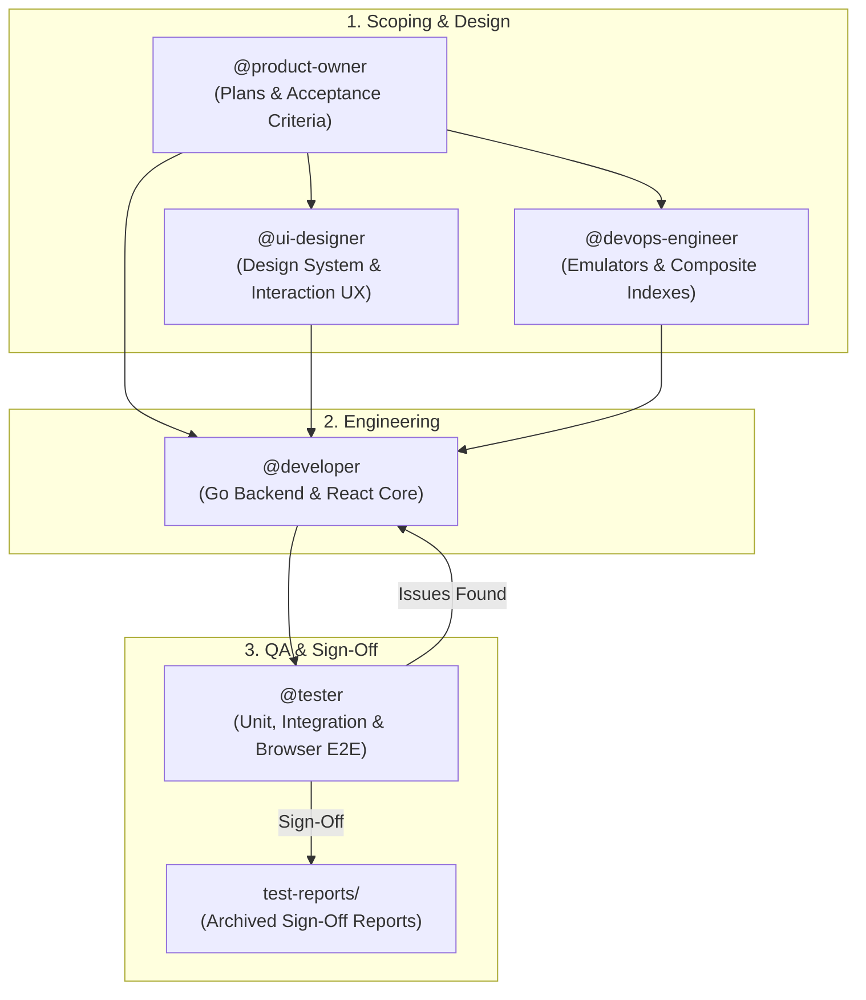

# DailyCheckIn - Multi-Agent Squad & Collaboration Guide

This document outlines the roles, responsibilities, handoff contracts, and end-to-end workflows of the **5-Agent Agile Squad** collaborating to build, test, and maintain **DailyCheckIn**.

---

## 1. The 5-Agent Agile Squad



---

## 2. Detailed Agent Profiles

### 📋 1. `@product-owner` — Product Owner & Agile Architect
- **Definition File:** [`.agents/agents/product-owner.md`](../.agents/agents/product-owner.md)
- **Primary Goal:** Translate product vision into clear, unambiguous, and prioritized technical specifications in `/plans/`.
- **Core Responsibilities:**
  1. **Domain Integrity:** Enforces the core domain model (`DaySession`, master `Task`, `DayTask`, 4 rows: Yesterday, Today, Blocked, Backlog, and ritual wizards).
  2. **Scope Protection:** Prevents feature creep and premature complexity (e.g., enterprise multi-tenancy before personal single-user rituals are perfected).
  3. **Plan Authoring:** Writes `/plans/PLAN-<feature-name>.md` with clear Gherkin (`Given / When / Then`) acceptance criteria covering happy paths, edge cases, and validation rules.
  4. **Vertical Slicing:** Breaks large initiatives into incremental, testable layers.

---

### 🎨 2. `@ui-designer` — Lead UI/UX & Frontend Designer
- **Definition File:** [`.agents/agents/ui-designer.md`](../.agents/agents/ui-designer.md)
- **Primary Goal:** Deliver a premium, fast, and accessible user experience with cohesive visual design.
- **Core Responsibilities:**
  1. **Design System & Theming:** Maintains Tailwind CSS tokens in `tailwind.config.js` and `frontend/src/index.css` with dark and light mode support.
  2. **Interactive Board UX:** Designs visual states and physics for drag-and-drop task reordering (`@hello-pangea/dnd`) across Yesterday, Today, Blocked, and Backlog.
  3. **Calendar & Ritual Flows:** Designs the month-view calendar status indicators, Morning Check-In and End-of-Day Check-Out modal wizards, and Standup Markdown export previews.
  4. **Accessibility:** Ensures WCAG AA contrast, keyboard accessibility (e.g., rapid check-in keyboard shortcuts), and responsive layouts.

---

### 💻 3. `@developer` — Lead Software Developer
- **Definition File:** [`.agents/agents/agile-developer.md`](../.agents/agents/agile-developer.md)
- **Primary Goal:** Implement full-stack Go Echo services and React client features adhering strictly to architectural boundaries.
- **Core Responsibilities:**
  1. **Backend Layering (Go 1.23+ / Echo v4):**
     - `internal/api/` — Request binding, input validation, and HTTP responses.
     - `internal/service/` — Core business logic, session rollover rules, and multi-document Firestore transactions.
     - `internal/repository/` — Firestore document mappings and database queries.
     - `internal/model/` — Domain structs and API DTOs.
  2. **Frontend State & Integration (React 18+ / TypeScript):**
     - TanStack Query (React Query) server state management with query key factories.
     - Optimistic updates for task checkbox completions and drag-and-drop reordering.
     - Date timezone normalization using `date-fns` (`YYYY-MM-DD` ISO strings).
     - Single-binary asset bundling via Go's `//go:embed`.
  3. **Pre-Flight Self-Check:** Runs `go test ./...` and `npm run build` locally before handing off to QA.

---

### ☁️ 4. `@devops-engineer` — DevOps & Cloud Infrastructure
- **Definition File:** [`.agents/agents/devops-engineer.md`](../.agents/agents/devops-engineer.md)
- **Primary Goal:** Provide frictionless local emulator environments, secure cloud infrastructure, optimized container builds, and reliable CI/CD pipelines.
- **Core Responsibilities:**
  1. **Local Emulator Suite:** Manages `docker-compose.yml` and `firebase.json` for Firebase Local Emulators (Firestore on `:8080`, Auth on `:9099`, UI on `:4000`).
  2. **Containerization:** Maintains the multi-stage `Dockerfile` (Vite build $\rightarrow$ Go build $\rightarrow$ scratch/Alpine runtime) ensuring minimal image size and fast build caching.
  3. **Firestore Database Configuration:** Maintains `firestore.indexes.json` (composite indexes) and audits Firestore security rules (`firestore.rules`).
  4. **CI/CD Automation:** Manages GitHub Actions workflows for automated testing, linting, and Google Cloud Run deployment.

---

### 🧪 5. `@tester` — QA & Test Automation Engineer
- **Definition File:** [`.agents/agents/agile-tester.md`](../.agents/agents/agile-tester.md)
- **Primary Goal:** Verify every acceptance criterion, catch regressions, execute end-to-end user journeys, and persist verifiable test evidence.
- **Core Responsibilities:**
  1. **Backend Testing:** Table-driven unit tests for Go services and integration tests against local Firestore emulator (`FIRESTORE_EMULATOR_HOST=localhost:8080`).
  2. **Frontend Testing:** Hook, component, and utility unit tests with Vitest and React Testing Library.
  3. **Browser E2E Validation:** Uses the headless browser (`/browser`) to test user flows (Morning Check-In wizard, board drag-and-drop, Standup markdown export, calendar date jumping).
  4. **Test Archival:** Persists all sign-off reports to `test-reports/QA-REPORT-<feature-name>-<YYYY-MM-DD>.md` and logs/screenshots to `test-results/`.
  5. **Privacy & Path Sanitization:** Enforces strict guardrails ensuring all test outputs (`test-results/`) and reports (`test-reports/`) contain only project-relative paths and zero personal data (usernames, home paths, personal emails) or credentials.

---

## 3. End-to-End Collaboration Lifecycle & Scrum Workflows

The squad executes work across seven defined Scrum workflows. Detailed step-by-step procedures, matrices, and checklists are documented in [**`docs/WORKFLOWS.md`**](./WORKFLOWS.md) and individual runbooks in [**`.agents/workflows/`**](../.agents/workflows/) and [**`.agents/skills/`**](../.agents/skills/).

```text
Workflow 1: Backlog Refinement & Story Scoping   [@product-owner, @ui-designer, @devops-engineer]
            - Authors /plans/PLAN-<feature-name>.md with Gherkin acceptance criteria
            - Enforces Definition of Ready (DoR)

Workflow 2: Sprint & Milestone Kickoff           [Squad]
            - Feature branch setup (feat/<milestone-or-feature>)
            - Docker emulator suite health check (:8080, :9099, :4000)

Workflow 3: Feature Swarming & Implementation    [@developer + @ui-designer]
            - Go Echo backend layers & React client state
            - Pre-flight self-verification (go test ./..., npm run build)

Workflow 4: Blocker Triage & Daily Standup       [Squad]
            - Rapid impediment classification & escalation routing

Workflow 5: QA Verification & Acceptance Gate    [@tester]
            - Automated emulator integration & /browser headless journeys
            - Persistent, sanitized test archival to test-reports/ & test-results/

Workflow 6: Sprint Review & Sign-Off             [@product-owner, @tester, User]
            - Verification against Definition of Done (DoD)
            - Visual demo evidence & user sign-off

Workflow 7: Sprint Retrospective & Continuous Imp. [Squad]
            - Milestone retrospective, rule tuning, and skill codification
```

---

## 4. Standard Artifacts & Handoff Contracts

| Phase / Ceremony | Artifact / Location | Owner | Consumer |
| :--- | :--- | :--- | :--- |
| **Specification (DoR)** | `/plans/PLAN-<feature-name>.md` | `@product-owner` | `@developer`, `@tester`, `@ui-designer` |
| **Design Tokens** | `tailwind.config.js`, `frontend/src/index.css` | `@ui-designer` | `@developer` |
| **Infrastructure** | `docker-compose.yml`, `firestore.indexes.json` | `@devops-engineer` | `@developer`, `@tester` |
| **Workflow Runbooks** | `.agents/workflows/`, `.agents/skills/` | Squad | All Agents |
| **Source Code** | `internal/...`, `frontend/src/...` | `@developer` | `@tester` |
| **QA Sign-Off Report** | `test-reports/QA-REPORT-<feature>-<date>.md` (audited for path & privacy hygiene) | `@tester` | `@product-owner`, Team |
| **Test Logs & Media** | `test-results/screenshots/`, `test-results/*.log` (sanitized project-relative paths, zero PII) | `@tester` | Team Audit |


---

## 5. Feedback Loops & Blocker Resolution

1. **Bug / Regression Loop:**
   - When `@tester` identifies a failing acceptance criterion or UI discrepancy, `@tester` logs the failed scenario, attaches screenshots from `test-results/screenshots/`, and assigns the issue back to `@developer`.
   - `@developer` applies the fix, re-runs local pre-flight checks, and notifies `@tester` for re-validation.
2. **Infrastructure / Index Blocker:**
   - If a complex query fails during development with a "Missing composite index" Firestore error, `@developer` informs `@devops-engineer`, who generates and commits the updated `firestore.indexes.json`.
3. **Scope Clarification:**
   - If edge cases emerge during development (e.g., handling cross-year date jumps or daylight savings time shifts), `@developer` or `@tester` escalates to `@product-owner` to amend the plan's acceptance criteria before proceeding.
