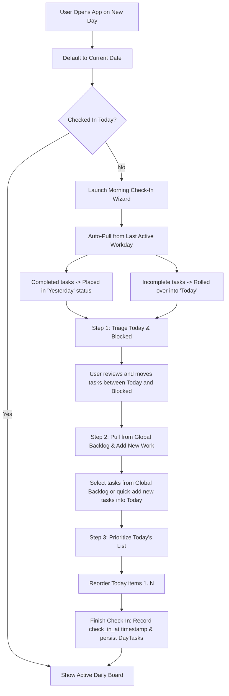
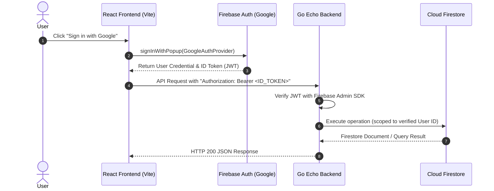

# DailyCheckIn - Product Specification

**Status:** Draft / Specification Phase  
**Target Audience:** Individual Technology & Knowledge Workers  
**Core Purpose:** Personal morning ritual and daily execution tool combining Scrum principles (Yesterday, Today, Blocked, Backlog) with date-based session tracking and multi-day task history.

---

## 1. Core Architecture & Concepts

### 1.1 Days as First-Class Sessions
A **Day Entry** (`DaySession`) represents a distinct workday with explicit session lifecycle events:
- **`check_in_at`**: Timestamp when the user completes the morning check-in wizard.
- **`check_out_at`**: Timestamp when the user completes the end-of-day check-out / reflection.
- **`date`**: Unique calendar date (e.g., `YYYY-MM-DD`).

### 1.2 Multi-Day Task Model & Day-Task Associations
Tasks are persistent entities that can span across multiple days. A task has a master identity (`Task`) and day-specific instances/logs (`DayTask`):
- **Master Task (`Task`)**: Holds the title, description/notes, tags, overall completion state (`is_completed`, `completed_at`), archive state, backlog priority rank (`backlog_order`), and original creation timestamp. Unassigned tasks in this master pool constitute the user's persistent, cross-day **Global Backlog**.
- **DayTask Association (`DayTask`)**: Binds a task committed to a specific `DaySession`, capturing:
  - `status_for_day`: Row/section during that day (`YESTERDAY`, `TODAY`, `BLOCKED`). (Note: Backlog is managed globally at the master `Task` level; a `DayTask` is only created when committed to a day).
  - `is_completed`: Boolean indicating if the task was marked completed on this day.
  - `completed_at`: Exact timestamp when the task was checked complete on this day.
  - `priority_order`: Order index in that day's active row (`Today` or `Blocked`).
  - `blocker_reason`: Blocker explanation if marked `BLOCKED` on that day.

---

## 2. Core Concepts & Task States

The application organizes tasks into four distinct core sections:

| Section / Bucket | Description | Completion Behavior |
| :--- | :--- | :--- |
| **Yesterday** | Tasks completed on the previous active workday (`is_completed = true`). Serves as a record of accomplishments. | Read/review accomplishments. |
| **Today** | The active, strictly prioritized list of tasks targeted for the current workday. | Checkbox toggles `is_completed` and stamps `completed_at` on both `DayTask` and master `Task`. |
| **Blocked** | Tasks paused due to an external dependency or waiting on a change. | Includes blocker explanation; unblocking moves task to *Today* or returns it to the global *Backlog*. |
| **Backlog** | Persistent, cross-day pool of unscheduled master tasks. Managed globally rather than duplicated per day session. | Can be prioritized globally and pulled into *Today* during morning check-in or dynamically throughout the workday when work items run low. |

```
+---------------------------------------------------------------------------------------------------------+
| [DailyCheckIn]                               [Today: Mon, Aug 24]                     [User / Settings] |
+---------------------------------------------------------------------------------------------------------+
| [ <  AUG 2026  > ]  Su Mo Tu We Th Fr Sa |  DAY SESSION: [Checked In: 09:15 AM]  [Check-Out Button]     |
| (Top-Left Calendar)  1  2  3  4  5  6  7  |  ACTIONS:     [Copy Standup Markdown]                        |
|                      8  9 10 11 12 13 14  |                                                             |
|                     15 16 17 18 19 20 21  |                                                             |
|                     22 23[24]25 26 27 28  |                                                             |
|                     29 30 31 [Jump Today] |                                                             |
+=========================================================================================================+
| ROW 1: YESTERDAY (Completed Accomplishments from Previous Day)                                          |
|---------------------------------------------------------------------------------------------------------|
|  [✓] Review PR #104 (Completed 04:30 PM)                                                                |
|  [✓] Deploy staging migration (Completed 05:15 PM)                                                      |
+=========================================================================================================+
| ROW 2: TODAY (Actively Prioritized Work)                                          [+ Add Task to Today] |
|---------------------------------------------------------------------------------------------------------|
|  ::  1. [ ] Implement top-left calendar UI widget                             (High Priority)           |
|  ::  2. [ ] Build morning check-in wizard modal                               (Medium Priority)         |
|  ::  3. [ ] Connect Firestore day_tasks sync                                  (Medium Priority)         |
+=========================================================================================================+
| ROW 3: BLOCKED (Waiting on Dependencies)                                                                |
|---------------------------------------------------------------------------------------------------------|
|  [!] Auth token refresh glitch              | REASON: Waiting on Firebase Admin SDK update (PR #52)     |
+=========================================================================================================+
| ROW 4: BACKLOG (Future Work Pool)                                               [+ Add Task to Backlog] |
|---------------------------------------------------------------------------------------------------------|
|  ::  - Add dark mode theme support                                                                      |
|  ::  - Add weekly accomplishments rollup export                                                         |
+---------------------------------------------------------------------------------------------------------+
```

### 2.1 UI Components
1. **Top Navigation Bar:**
   - App title/branding.
   - Current active date display with indicators (e.g., green dot if checked in, yellow if pending check-in).
   - User profile / settings / standup export button.
2. **Top-Left Interactive Calendar:**
   - Month view with date picker.
   - Visual dots/markers on days indicating check-in status (e.g., completed check-in, missed, or future).
   - Clicking any past date loads that day's snapshot in read-only / history review mode.
   - "Jump to Today" quick button.
3. **Day Session Action Bar:**
   - Displays Check-In and Check-Out status and timestamps for the selected day.
   - Action buttons: "Start Check-In" (if not checked in) or "Check-Out" (if day is active).
4. **4-Row Daily Layout:**
   - **Row 1 - Yesterday:** Displays tasks marked completed on the previous active workday.
   - **Row 2 - Today:** The active, ordered list for the current day with inline "+ Add Task". Supports drag-and-drop or up/down ordering. Checkbox immediately stamps `completed_at`.
   - **Row 3 - Blocked:** Tasks marked as blocked, with visible blocker explanation chip/text.
   - **Row 4 - Backlog:** Persistent global pool of unassigned master tasks available to pull into any day, with inline "+ Add to Backlog", drag-and-drop prioritization, and 1-click "Pull into Today" quick actions.

---

## 3. Workflows & State Machine

### 3.1 Login & Morning Check-In Wizard Flow
When the user accesses the app:
1. **Date Resolution:** Automatically navigate to the current local date.
2. **Check-In Verification:** Check if a `DaySession` exists with a non-null `check_in_at`.
   - If checked in: Display the full interactive Day Board.
   - If not checked in: Show a welcoming prompt: *"Ready to start your day? [Start Morning Check-In]"*.



### 3.2 Throughout the Workday
- **Story:** As a user working through the day, I want to track my progress and organize incoming work with minimal friction, pulling new tasks from my backlog whenever current work items run low.
- **Dynamic Task Creation:**
  - **Add to Today:** Quick-add tasks directly to the *Today* list. Creates a master `Task` and an active `DayTask` linked to the current `DaySession` with status `TODAY`.
  - **Add to Backlog:** Quick-add tasks directly to the *Backlog* pool to capture incoming requests, ideas, or future work without disrupting today's focus (creates an uncommitted master `Task` in the global backlog).
- **Sorting & Prioritization:**
  - **Today List Sorting:** Full manual drag-and-drop / rank reordering (1..N priority order) so the highest-priority work stays on top.
  - **Backlog List Sorting:** Full manual drag-and-drop / priority reordering across the global backlog (`backlog_order`), with optional sort presets (e.g., creation date, manual priority rank).
- **Mid-Day Backlog Pulls (Low Workload Acceleration):**
  - Whenever active *Today* tasks run low or finish early, users can instantly pull items from the global Backlog into *Today* via drag-and-drop, the inline "Pull into Today" button, or keyboard shortcut (`P`).
  - Pulling an item creates an active `DayTask` record for the current day session without modifying or duplicating the backlog history.
  - When all *Today* items are completed, the UI displays a subtle "Ready for more? Pull top item from Backlog" helper.
- **Task Lifecycle Actions:**
  - **Complete a Task:** Checking off a task sets `is_completed = true` and `completed_at = now()` on the `day_tasks` entry and sets `is_completed = true` and `completed_at = now()` on the master `tasks` record.
  - **Uncomplete a Task:** Unchecking sets `is_completed = false` and `completed_at = NULL` on both records.
  - **Move a task to BLOCKED:** Prompts for an optional reason note.
  - **Demote Task to Backlog:** Removing a task from *Today* back to *Backlog* deletes/closes the `DayTask` commitment for that day, returning the master task to the global backlog pool.

### 3.3 Standup Summary Export
- A 1-click button generates a clean standup summary formatted for Slack / Teams / Email:
  ```markdown
  **Yesterday:**
  - Completed user auth endpoint
  - Reviewed PR #104

  **Today:**
  - [ ] Implement calendar widget UI (Priority 1)
  - [ ] Wire check-in wizard state (Priority 2)

  **Blocked:**
  - Database migration on staging (Waiting on DevOps permissions)
  ```

### 3.4 End of Day Check-Out Wizard Flow
When the user finishes their workday, they click **"Check-Out"**:
1. **Confirm Incomplete Tasks:**
   - Displays all tasks remaining incomplete in *Today*.
   - Option to mark any as completed (e.g., completed offline/late) or leave incomplete.
2. **Move Remaining Tasks to Backlog:**
   - Asks if any unfinished *Today* tasks should be demoted back to the global *Backlog* (removing the day commitment) vs. left in *Today* for the next workday's rollover.
3. **Optional Daily Reflection:**
   - Space to add optional notes/reflections for the day.
4. **Finalize Check-Out:**
   - Records `check_out_at = now()`.
   - Day board switches to completed/checked-out state.

---

## 4. Complete Data Schema & Firestore Model

### 4.1 Relational & Entity Representation
```sql
CREATE TABLE day_sessions (
    id TEXT PRIMARY KEY,               -- UUID / Document ID
    user_id TEXT NOT NULL,
    date DATE NOT NULL UNIQUE,         -- Date 'YYYY-MM-DD'
    check_in_at DATETIME,              -- DateTime when check-in completed
    check_out_at DATETIME,             -- DateTime when check-out completed
    notes TEXT,                        -- Optional reflection notes
    created_at DATETIME NOT NULL DEFAULT CURRENT_TIMESTAMP,
    updated_at DATETIME NOT NULL DEFAULT CURRENT_TIMESTAMP
);

CREATE TABLE tasks (
    id TEXT PRIMARY KEY,               -- UUID / Document ID
    user_id TEXT NOT NULL,
    title TEXT NOT NULL,
    description TEXT,
    is_completed BOOLEAN DEFAULT 0,    -- 0: Incomplete, 1: Completed
    completed_at DATETIME,             -- DateTime when task was completed
    is_archived BOOLEAN DEFAULT 0,     -- 0: Active, 1: Soft-deleted
    backlog_order INTEGER DEFAULT 0,   -- Global priority rank in backlog pool
    created_at DATETIME NOT NULL DEFAULT CURRENT_TIMESTAMP,
    updated_at DATETIME NOT NULL DEFAULT CURRENT_TIMESTAMP
);

CREATE TABLE day_tasks (
    id TEXT PRIMARY KEY,               -- UUID / Document ID
    day_session_id TEXT NOT NULL,
    task_id TEXT NOT NULL,
    status TEXT NOT NULL,              -- 'YESTERDAY' | 'TODAY' | 'BLOCKED'
    is_completed BOOLEAN DEFAULT 0,    -- 0: Incomplete on this day, 1: Completed on this day
    completed_at DATETIME,             -- DateTime when marked complete on this day
    priority_order INTEGER DEFAULT 0,  -- Priority order within that day's Today/Blocked list
    blocker_reason TEXT,
    created_at DATETIME NOT NULL DEFAULT CURRENT_TIMESTAMP,
    updated_at DATETIME NOT NULL DEFAULT CURRENT_TIMESTAMP,
    FOREIGN KEY(day_session_id) REFERENCES day_sessions(id) ON DELETE CASCADE,
    FOREIGN KEY(task_id) REFERENCES tasks(id) ON DELETE CASCADE,
    UNIQUE(day_session_id, task_id)
);
```

### 4.2 Firestore Collection Structure
```
users/{userId}
  ├── tasks/{taskId}
  │     ├── id: string (UUID)
  │     ├── title: string
  │     ├── description: string
  │     ├── is_completed: boolean
  │     ├── completed_at: Timestamp (nullable)
  │     ├── is_archived: boolean
  │     ├── backlog_order: number          // Global rank in backlog pool
  │     ├── created_at: Timestamp
  │     └── updated_at: Timestamp
  │
  └── day_sessions/{date}   // Keyed by date (YYYY-MM-DD)
        ├── id: string
        ├── date: string (YYYY-MM-DD)
        ├── check_in_at: Timestamp (nullable)
        ├── check_out_at: Timestamp (nullable)
        ├── notes: string
        ├── created_at: Timestamp
        ├── updated_at: Timestamp
        │
        └── day_tasks/{dayTaskId}
              ├── id: string
              ├── task_id: string (reference to users/{userId}/tasks/{taskId})
              ├── status: "YESTERDAY" | "TODAY" | "BLOCKED"
              ├── is_completed: boolean
              ├── completed_at: Timestamp (nullable)
              ├── priority_order: number
              ├── blocker_reason: string (optional)
              ├── created_at: Timestamp
              └── updated_at: Timestamp
```

---

## 5. API & Data Contract Specifications

### 5.1 Standardized Error Envelope
All error responses from the Echo backend follow a unified JSON envelope:
```json
{
  "error": {
    "code": "VALIDATION_FAILED",
    "message": "Task title cannot be empty",
    "status": 400,
    "details": {}
  }
}
```

### 5.2 Endpoint Schemas & Payloads

#### `GET /api/days/:date`
- **Headers:** `Authorization: Bearer <ID_TOKEN>`, `X-Timezone: <IANA_Timezone>`
- **Response `200 OK`:**
```json
{
  "session": {
    "id": "session-uuid",
    "date": "2026-08-27",
    "check_in_at": "2026-08-27T09:15:00Z",
    "check_out_at": null,
    "notes": ""
  },
  "tasks": {
    "yesterday": [
      {
        "day_task_id": "dt-1",
        "task_id": "t-1",
        "title": "Review PR #104",
        "description": "",
        "status": "YESTERDAY",
        "is_completed": true,
        "completed_at": "2026-08-26T16:30:00Z",
        "priority_order": 0
      }
    ],
    "today": [
      {
        "day_task_id": "dt-2",
        "task_id": "t-2",
        "title": "Implement calendar UI",
        "description": "Top-left month picker",
        "status": "TODAY",
        "is_completed": false,
        "completed_at": null,
        "priority_order": 1,
        "blocker_reason": null
      }
    ],
    "blocked": [
      {
        "day_task_id": "dt-3",
        "task_id": "t-3",
        "title": "Deploy staging DB",
        "description": "",
        "status": "BLOCKED",
        "is_completed": false,
        "completed_at": null,
        "priority_order": 0,
        "blocker_reason": "Waiting on DevOps permissions"
      }
    ]
  }
}
```

#### `GET /api/backlog`
- **Headers:** `Authorization: Bearer <ID_TOKEN>`
- **Response `200 OK`:**
```json
{
  "tasks": [
    {
      "id": "t-4",
      "title": "Refactor auth middleware",
      "description": "Migrate to Echo native JWT middleware",
      "is_completed": false,
      "backlog_order": 1,
      "created_at": "2026-08-20T10:00:00Z",
      "updated_at": "2026-08-20T10:00:00Z"
    },
    {
      "id": "t-5",
      "title": "Add dark mode theme support",
      "description": "Tailwind dark mode classes and toggle",
      "is_completed": false,
      "backlog_order": 2,
      "created_at": "2026-08-21T14:30:00Z",
      "updated_at": "2026-08-21T14:30:00Z"
    }
  ]
}
```

#### `POST /api/backlog/tasks`
- **Request Body:**
```json
{
  "title": "Add weekly accomplishments rollup export",
  "description": "Export markdown summary grouped by week"
}
```
- **Response `201 Created`:** Returns created `Task` with assigned `backlog_order`.

#### `PUT /api/backlog/reorder`
- **Request Body:**
```json
{
  "ordered_task_ids": ["t-5", "t-4"]
}
```
- **Response `200 OK`:** Returns `{ "success": true }`.

#### `POST /api/days/:date/pull`
- **Description:** Pulls a task from the global backlog into the specified day session.
- **Request Body:**
```json
{
  "task_id": "t-4",
  "status": "TODAY",
  "priority_order": 2
}
```
- **Response `201 Created`:** Returns created `DayTask`.

#### `POST /api/days/:date/tasks/:dayTaskId/demote`
- **Description:** Demotes a task from today/blocked back to the uncommitted global backlog (removes the `DayTask` commitment).
- **Response `200 OK`:** Returns `{ "success": true }`.

#### `POST /api/days/:date/check-in`
- **Request Body:**
```json
{
  "today_task_ids": ["t-2", "t-5"],
  "blocked_tasks": [
    { "task_id": "t-3", "blocker_reason": "Waiting on PR review" }
  ],
  "priority_order": ["t-2", "t-5"]
}
```
- **Response `200 OK`:** Returns full DaySession and updated DayTasks structure.

#### `POST /api/days/:date/check-out`
- **Request Body:**
```json
{
  "notes": "Finished calendar UI ahead of schedule.",
  "demote_to_backlog_task_ids": ["t-6"]
}
```
- **Response `200 OK`:** Returns updated DaySession with `check_out_at` timestamp.

#### `POST /api/tasks`
- **Description:** Quick-add a task, optionally targeting an active day session or defaulting to global backlog.
- **Request Body:**
```json
{
  "title": "Fix date boundary timezone parsing",
  "description": "Ensure IANA timezones are handled cleanly",
  "target_date": "2026-08-27",
  "status": "TODAY"
}
```
- **Response `201 Created`:** Returns created `Task` and associated `DayTask` (if `target_date` provided).

#### `PATCH /api/day-tasks/:id`
- **Request Body:**
```json
{
  "status": "BLOCKED",
  "is_completed": false,
  "blocker_reason": "Blocked by CI pipeline outage"
}
```
- **Response `200 OK`:** Returns updated `DayTask`.

#### `PUT /api/day-tasks/reorder`
- **Request Body:**
```json
{
  "day_session_date": "2026-08-27",
  "status": "TODAY",
  "ordered_day_task_ids": ["dt-2", "dt-5", "dt-7"]
}
```
- **Response `200 OK`:** Returns `{ "success": true }`.

#### `GET /api/calendar/summary?month=YYYY-MM`
- **Response `200 OK`:**
```json
{
  "days": [
    { "date": "2026-08-24", "has_check_in": true, "has_check_out": true, "completed_count": 4 },
    { "date": "2026-08-25", "has_check_in": true, "has_check_out": false, "completed_count": 2 },
    { "date": "2026-08-26", "has_check_in": false, "has_check_out": false, "completed_count": 0 }
  ]
}
```

---

## 6. Timezone Strategy, Edge Cases & Business Rules

### 6.1 Canonical Timezone & Date Boundary Strategy
1. **User Local Date Key (`date`):**
   - The primary calendar key `date` is always formatted as `YYYY-MM-DD` generated from the client browser's local timezone.
   - All client API calls send the `X-Timezone` header (e.g. `America/Los_Angeles`, `Europe/London`).
2. **Universal Timestamps (`DATETIME` / Firestore Timestamp):**
   - All event timestamps (`check_in_at`, `check_out_at`, `completed_at`, `created_at`, `updated_at`) are stored in canonical UTC.
3. **Midnight & Cross-Timezone Handling:**
   - Tasks do not shift automatically across dates mid-session without explicit user action or morning check-in initialization.

### 6.2 Edge Cases & Business Rules
1. **Skipped Days & Weekends:**
   - Morning Check-In looks backward to find the *most recent active workday* session to populate Yesterday accomplishments and rollover incomplete items, seamlessly handling weekends and vacations.
2. **Historical Day Navigation:**
   - Navigating to past dates displays that day's state as of its check-out. Past edits flag a non-destructive audit notice.
3. **Mid-Day Task Transitions:**
   - Tasks can be moved between *Today*, *Blocked*, and *Backlog* dynamically throughout the day without modifying the session's check-in timestamp.
4. **Soft Archiving:**
   - Deleting a task with historical associations sets `is_archived = true`, preserving integrity for past day logs.

---

## 7. Non-Functional & Usability Requirements

1. **Optimistic UI Updates:** Instant UI response when checking off tasks or dragging items, syncing to backend asynchronously.
2. **Keyboard Accessibility:** `N` (new task), `Cmd+Enter` (save), `Esc` (dismiss modal), `/` (search backlog).
3. **Offline Resilience:** State cached locally via TanStack Query; network errors trigger automated retry with toast alerts.

---

## 8. Technology Stack

### Backend
- **Language**: Golang (1.23+)
- **API Framework**: Echo (`github.com/labstack/echo/v4`)
- **Database & Auth**: Google Cloud Firebase (Firestore & Firebase Admin SDK)
- **Static Asset Embedding**: Go `embed.FS` (embeds Vite React production build into single executable binary)

### Frontend
- **Framework**: ReactJS (18+)
- **Build Tool / Bundler**: Vite
- **Language**: TypeScript
- **Styling**: Tailwind CSS
- **State Management**:
  - **Global UI State**: React Context (active date, current user/auth state, modal visibility)
  - **Server State & Caching**: TanStack Query / React Query (optimistic UI updates, caching, background refetching)
- **Drag & Drop**: `@hello-pangea/dnd` (accessible drag-and-drop list reordering for Today and Backlog)
- **Date Utilities**: `date-fns`
- **Icons**: Lucide React (`lucide-react`)
- **API Client**: Fetch (typed client wrapper with Firebase ID Token injection)
- **Routing**: React Router (`react-router-dom`)

### Infrastructure & DevOps
- **Database**: Google Cloud Firestore
- **Authentication**: Firebase Authentication with Google Auth
- **Hosting / Compute**: Google Cloud Run (Fully managed serverless container runtime, scales to zero)
- **Containerization**: Multi-stage Dockerfile (Node.js for Vite build + Golang for binary build $\rightarrow$ Scratch/Alpine runner)
- **Local Dev Environment**: Docker Compose with Firebase Local Emulator Suite (Firestore & Auth emulators for 100% offline local development)
- **Build Automation**: Makefile (`make dev`, `make build`, `make test`, `make docker-build`, `make emulators`)
- **Version Control**: GitHub
- **CI/CD**: GitHub Actions (lint, test, build container, and deploy to Google Cloud Run)
- **File Storage**: Local filesystem (dev), Google Cloud Storage (prod)

---

## 9. Security & Deployment Architecture

### 9.1 Single Embedded Binary Deployment
```
+-------------------------------------------------------------------------+
| Single Container / Binary (Google Cloud Run / Alpine)                    |
|                                                                         |
|  +---------------------------+       +-------------------------------+  |
|  | Go Echo Router            |       | Embedded Vite React SPA       |  |
|  |                           |       | (go:embed dist/*)             |  |
|  | - /api/days/*             |       |                               |  |
|  | - /api/tasks/*            |       | - index.html                  |  |
|  | - /api/calendar/*         |       | - assets/*.js, *.css          |  |
|  | - Auth Middleware         |       |                               |  |
|  +-------------+-------------+       +---------------+---------------+  |
|                |                                     |                  |
|                v                                     v                  |
|          REST Endpoints                     SPA Client Fallback (/*)    |
+----------------+-------------------------------------+------------------+
                 |
                 v
        Google Cloud Firestore
```

### 9.2 Authentication & Authorization Flow


---

## 10. Codebase & Directory Structure

```text
DailyCheckIn/
├── cmd/
│   └── server/
│       └── main.go                 # Echo server entrypoint & graceful shutdown
├── internal/
│   ├── api/
│   │   ├── handler.go              # Root HTTP handler & router registration
│   │   ├── day_handler.go          # Day session, check-in/out, and pull-from-backlog endpoints
│   │   ├── task_handler.go         # Task CRUD & day-task reorder endpoints
│   │   ├── backlog_handler.go      # Global backlog CRUD & reorder endpoints
│   │   └── calendar_handler.go     # Monthly summary endpoint
│   ├── middleware/
│   │   ├── auth.go                 # Firebase ID Token verification middleware
│   │   └── logging.go              # Structured request logger & CORS
│   ├── service/
│   │   ├── day_service.go          # Business logic: Check-in / Check-out wizards, rollovers
│   │   ├── task_service.go         # Business logic: Multi-day task synchronization
│   │   └── backlog_service.go      # Business logic: Global backlog prioritization & pulling
│   ├── repository/
│   │   ├── firestore_repo.go       # Firestore client wrapper & transaction helpers
│   │   ├── day_repo.go             # Firestore day_sessions collection queries
│   │   └── task_repo.go            # Firestore tasks & day_tasks subcollection queries
│   └── model/
│       ├── day.go                  # DaySession & DayTask Go structs
│       ├── task.go                 # Task Go struct (includes BacklogOrder)
│       └── response.go             # Standard JSON response & error envelopes
├── frontend/
│   ├── index.html
│   ├── vite.config.ts
│   ├── package.json
│   ├── tailwind.config.js
│   └── src/
│       ├── main.tsx                # React root & React Router provider
│       ├── App.tsx                 # Layout shell & route definitions
│       ├── api/
│       │   ├── client.ts           # Typed Fetch client with Firebase JWT injection
│       │   └── endpoints.ts        # API endpoint wrappers
│       ├── components/
│       │   ├── calendar/           # Top-left interactive month calendar
│       │   ├── board/              # 4-Row layout (Yesterday, Today, Blocked, Backlog)
│       │   ├── wizard/             # Check-In & Check-Out modal wizards
│       │   ├── tasks/              # TaskItem, InlineTaskCreate, BlockerModal
│       │   └── common/             # Button, Modal, Badge, Toast
│       ├── context/
│       │   ├── AuthContext.tsx     # Firebase user & token management
│       │   └── DateContext.tsx     # Active date state & navigation
│       └── hooks/
│           ├── useDaySession.ts    # React Query hook for /api/days/:date
│           ├── useBacklog.ts       # React Query hook for /api/backlog & reordering
│           └── useCalendar.ts      # React Query hook for /api/calendar/summary
├── firebase.json                   # Firebase Emulator Suite config
├── firestore.indexes.json          # Firestore composite indexes definition
├── Dockerfile                      # Multi-stage production container build
├── docker-compose.yml              # Local development services (Emulators)
├── Makefile                        # Dev, test, lint, and build automation
└── SPECIFICATION.md                # Project master specification
```

---

## 11. Firestore Indexes & Query Specifications

`firestore.indexes.json`:
```json
{
  "indexes": [
    {
      "collectionGroup": "day_tasks",
      "queryScope": "COLLECTION",
      "fields": [
        { "fieldPath": "status", "order": "ASCENDING" },
        { "fieldPath": "priority_order", "order": "ASCENDING" }
      ]
    },
    {
      "collectionGroup": "tasks",
      "queryScope": "COLLECTION",
      "fields": [
        { "fieldPath": "is_archived", "order": "ASCENDING" },
        { "fieldPath": "is_completed", "order": "ASCENDING" },
        { "fieldPath": "backlog_order", "order": "ASCENDING" }
      ]
    },
    {
      "collectionGroup": "tasks",
      "queryScope": "COLLECTION",
      "fields": [
        { "fieldPath": "is_archived", "order": "ASCENDING" },
        { "fieldPath": "created_at", "order": "DESCENDING" }
      ]
    }
  ],
  "fieldOverrides": []
}
```

---

## 12. Environment Variables & Configuration Matrix

| Variable | Description | Default (Dev) | Production (Cloud Run) |
| :--- | :--- | :--- | :--- |
| `PORT` | Server listening port | `8080` | `8080` (injected by Cloud Run) |
| `APP_ENV` | Environment identifier | `development` | `production` |
| `FIREBASE_PROJECT_ID` | GCP / Firebase Project ID | `dailycheckin-local` | `dailycheckin-prod` |
| `FIRESTORE_EMULATOR_HOST` | Local Firestore emulator host | `localhost:8080` | *Unset* |
| `FIREBASE_AUTH_EMULATOR_HOST` | Local Auth emulator host | `localhost:9099` | *Unset* |
| `GOOGLE_APPLICATION_CREDENTIALS`| Service account key path | *Unset (uses emulators)*| Default GCP Service Account |

---

## 13. Testing & Quality Assurance Strategy

### 13.1 Backend Testing (Golang)
- **Unit Testing:** Table-driven tests (`testing`, `github.com/stretchr/testify/assert`) for service layer algorithms (rollover logic, standup formatting, priority ordering).
- **Integration Testing:** HTTP handler tests (`net/http/httptest`) executing against the running Firestore local emulator.

### 13.2 Frontend Testing (React)
- **Component Tests:** `Vitest` + `@testing-library/react` for UI components (Calendar selection, Check-In Wizard step progression, row sorting).
- **Type Checking & Linting:** `tsc --noEmit` and `eslint` in pre-commit and CI.

### 13.3 CI Automation (GitHub Actions)
- **`ci.yml` Workflow:**
  1. Go lint (`golangci-lint`) and unit/integration tests with emulator service container.
  2. Frontend lint and Vitest test suite.
  3. Docker multi-stage build check to verify binary embedding.
  4. Auto-deploy to Google Cloud Run upon merge to `main`.

