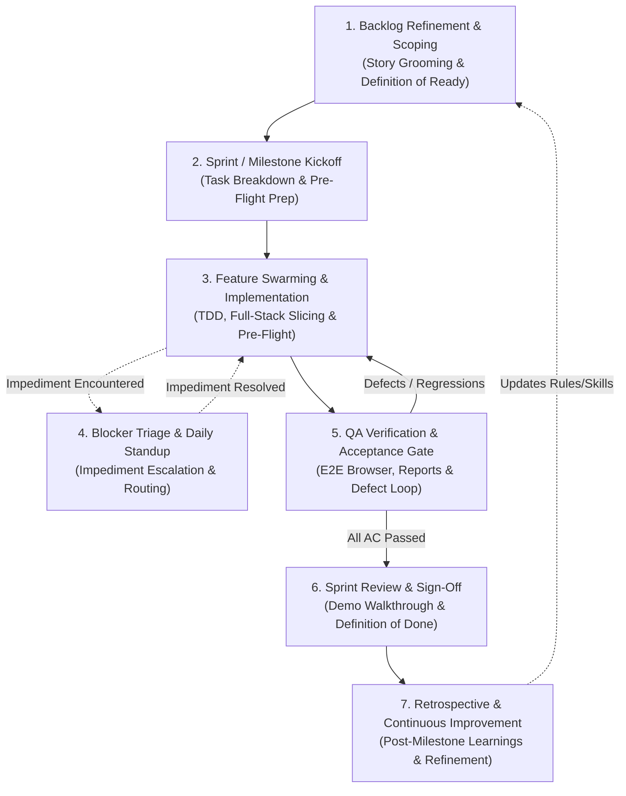

# DailyCheckIn - Agile Squad Scrum Workflows & Lifecycle Guide

This document defines the official **Scrum Workflows** for the 5-Agent Agile Squad collaborating on **DailyCheckIn**. These workflows govern how work moves from initial concept to tested, verified, and production-ready code.

---

## 1. Squad Overview & Lifecycle Map

The 5-role squad operates across seven sequential and reactive workflows:



### Squad Role Matrix

| Role | Agent Identifier | Primary Scrum Ownership |
| :--- | :--- | :--- |
| **Product Owner & Agile Architect** | [`@product-owner`](../.agents/agents/product-owner.md) | Story Scoping, Acceptance Criteria, Scope Protection, Sprint Review |
| **Lead UI/UX & Frontend Designer** | [`@ui-designer`](../.agents/agents/ui-designer.md) | Design Tokens, Interaction UX, Accessibility, Visual Fidelity |
| **Lead Software Developer** | [`@developer`](../.agents/agents/agile-developer.md) | Full-Stack Implementation (Go Echo + React SPA), TDD, Self-Verification |
| **DevOps & Cloud Infrastructure** | [`@devops-engineer`](../.agents/agents/devops-engineer.md) | Firebase Local Emulators, Composite Indexes, Docker Builds, CI/CD |
| **QA & Test Automation Engineer** | [`@tester`](../.agents/agents/agile-tester.md) | Automated Suites, E2E Browser Testing, Sign-Off Reports, Quality Gate |

---

## 2. The 7 Core Scrum Workflows

### Workflow 1: Backlog Refinement & Story Scoping
* **Scrum Equivalence:** Backlog Refinement / Story Grooming
* **Lead Agent:** `@product-owner`
* **Collaborators:** `@ui-designer`, `@devops-engineer`
* **Trigger:** New feature request, user requirement, or initiating the next item from [`plans/ROADMAP.md`](../plans/ROADMAP.md).
* **Objective:** Deliver a complete `/plans/PLAN-<feature-name>.md` meeting the **Definition of Ready (DoR)**.

#### Procedure:
1. **Scope & Domain Alignment (`@product-owner`):**
   - Verify alignment with `SPECIFICATION.md` (DaySession, Master Task, DayTask, 4 Rows, Ritual Wizards).
   - Prevent feature creep; break large features into incremental vertical slices.
2. **Design & UX Tokens (`@ui-designer`):**
   - Specify Tailwind color tokens, component layout, and empty/loading states.
   - Define drag-and-drop feedback physics or modal animation transitions.
3. **Database & Infrastructure Analysis (`@devops-engineer`):**
   - Audit required Firestore indexes and emulator port readiness.
4. **Acceptance Criteria Authoring (`@product-owner`):**
   - Write explicit Gherkin scenarios (`Given / When / Then`) covering happy paths, edge cases, and validation rules.

#### Definition of Ready (DoR) Gate Checklist:
- [ ] User story and scope boundaries clearly defined.
- [ ] Impact on domain models (`DaySession`, `Task`, `DayTask`) documented.
- [ ] API endpoint contracts and request/response DTO schemas specified.
- [ ] UI interaction, component hierarchy, and design tokens detailed.
- [ ] Explicit Gherkin acceptance criteria written for all scenarios.

---

### Workflow 2: Sprint & Milestone Kickoff
* **Scrum Equivalence:** Sprint Planning
* **Lead Agent:** `@product-owner` (Facilitator)
* **Collaborators:** Full Squad
* **Trigger:** Ready to implement an approved plan or roadmap milestone.
* **Objective:** Establish the implementation branch, verify environment readiness, and schedule task dependencies.

#### Procedure:
1. **Branch Management:**
   - Create or switch to the milestone/feature branch: `git checkout -b feat/<milestone-or-feature>`.
2. **Environment & Emulator Health Check (`@devops-engineer`):**
   - Ensure Docker Compose is active: `docker-compose up -d`.
   - Verify Firestore (`:8080`) and Auth (`:9099`) emulator health.
   - Run seed scripts if test fixture data is required.
3. **Dependency Sequencing (`@product-owner` & `@developer`):**
   - Deconstruct the plan into an execution order:
     1. Models & DTOs (`internal/model/`)
     2. Firestore Repository & Queries (`internal/repository/`)
     3. Business Logic & Services (`internal/service/`)
     4. HTTP API Handlers & Routing (`internal/api/`)
     5. React Client State & TanStack Query (`frontend/src/`)
     6. UI Components & Tailwind Styling (`frontend/src/components/`)
     7. Integration & E2E Verification (`test-reports/`)

---

### Workflow 3: Feature Swarming & Implementation
* **Scrum Equivalence:** Sprint Execution & Developer Pairing
* **Lead Agent:** `@developer`
* **Collaborators:** `@ui-designer`, `@devops-engineer`
* **Trigger:** Kickoff completed; working through vertical slices.
* **Objective:** Clean, modular, fully tested implementation matching architectural standards.

#### Procedure:
1. **Backend Implementation (Go 1.23+ Echo):**
   - Follow strict separation: `api` $\rightarrow$ `service` $\rightarrow$ `repo` $\rightarrow$ `model`.
   - Propagate `context.Context` through all database operations.
   - Use multi-document Firestore transactions for ritual wizards and rollover.
2. **Frontend Implementation (React 18+ / TypeScript / Tailwind CSS):**
   - Integrate TanStack Query keys using structured factory patterns.
   - Add optimistic updates for checkbox toggles and drag-and-drop reordering.
   - Format calendar dates strictly as `YYYY-MM-DD` ISO strings using `date-fns`.
   - Pair with `@ui-designer` for accessible, polished component styling.
3. **Pre-Flight Self-Verification (`@developer`):**
   - Run Go unit tests: `go test -v ./...`
   - Run Frontend tests: `cd frontend && npm test`
   - Verify production build: `cd frontend && npm run build && go build ./cmd/server`
4. **Handoff to QA:**
   - Provide summary of modified files, test command outputs, and critical paths to `@tester`.

---

### Workflow 4: Blocker Triage & Daily Standup
* **Scrum Equivalence:** Daily Scrum & Impediment Removal
* **Participants:** All Agents + User
* **Trigger:** An agent encounters an error, missing dependency, or ambiguous specification.
* **Objective:** Rapidly classify, assign, and unblock execution without thrashing.

#### Blocker Escalation Matrix:

| Blocker Type | Example Indicator | Responsible Agent | Resolution Action |
| :--- | :--- | :--- | :--- |
| **Database / Index** | `FAILED_PRECONDITION: The query requires an index` | `@devops-engineer` | Add composite index to `firestore.indexes.json` and reload emulator. |
| **Emulator / Environment** | `connection refused on localhost:8080` | `@devops-engineer` | Restart Docker Compose emulator container; inspect health logs. |
| **UI / Styling Ambiguity** | Unclear empty state or mobile breakpoint | `@ui-designer` | Provide concrete Tailwind classes, layout structure, or micro-animation. |
| **Domain / Spec Ambiguity** | Undefined rollover behavior over weekend | `@product-owner` | Amend Gherkin criteria in `/plans/PLAN-<feature>.md`. |
| **Code Regression / Defect** | Failing unit test or HTTP 500 error | `@developer` | Debug service layer, apply fix, and re-run pre-flight check. |

#### Standup Update Format (Matching DailyCheckIn's Model):
```markdown
### 📢 Agent Standup Update
- **Yesterday / Completed:** [Summary of completed slice or task]
- **Today / In Progress:** [Current active file or feature component]
- **Blocked:** [None / Blocker description with assigned agent]
```

---

### Workflow 5: QA Verification & Acceptance Gate
* **Scrum Equivalence:** Acceptance Testing & Quality Gate
* **Lead Agent:** `@tester`
* **Collaborator:** `@developer`
* **Trigger:** `@developer` completes pre-flight verification and requests QA handoff.
* **Objective:** Validate every Gherkin scenario, test regressions, execute browser E2E flows, and persist sign-off reports.

#### Procedure:
1. **Automated Suite Execution:**
   - Run Go integration tests with `FIRESTORE_EMULATOR_HOST=localhost:8080`.
   - Run Vitest component and hook test suites.
   - Capture console outputs into `test-results/*.log` (e.g. `go test -v ./... | tee test-results/backend-test.log`).
2. **Headless Browser E2E Journeys (`/browser`):**
   - Execute user journeys: Morning Check-In, drag-and-drop board reordering, checkbox completions, End-of-Day Check-Out, and Markdown Standup copying.
   - Capture visual screenshots in `test-results/screenshots/`.
3. **Defect Loop (If Acceptance Criteria Fail):**
   - File detailed defect note with: failing Gherkin scenario, expected vs. actual behavior, screenshot link, and reproduction steps.
   - Hand back to `@developer` for remediation.
4. **Privacy & Path Hygiene Audit:**
   - Audit test logs and reports to guarantee zero absolute system paths (`/Users/...`, `/home/...`), zero personal identifiers (usernames, emails), and zero leaked secrets or tokens.
5. **Sign-Off Archival:**
   - Compile and persist `test-reports/QA-REPORT-<feature-name>-<YYYY-MM-DD>.md` using the standard template.

---

### Workflow 6: Sprint Review & Sign-Off (Definition of Done)
* **Scrum Equivalence:** Sprint Review & Demo
* **Participants:** `@product-owner`, `@tester`, User (Product Sponsor)
* **Trigger:** `@tester` issues an **APPROVED** QA Report.
* **Objective:** Verify the complete Definition of Done (DoD) and gain stakeholder approval for merging into `main`.

#### Definition of Done (DoD) Checklist:
- [ ] All Gherkin acceptance criteria in `/plans/PLAN-<feature>.md` pass with verifiable evidence.
- [ ] Backend code adheres to Echo layering with `ctx` propagation and standard error handling.
- [ ] Frontend code adheres to design tokens, dark/light theme, and WCAG AA contrast.
- [ ] Go unit/service tests pass: `go test -v ./...`.
- [ ] Frontend tests and production bundle build cleanly: `npm test && npm run build`.
- [ ] Single binary packages static frontend assets (`//go:embed`).
- [ ] Test results (`test-results/`) and QA reports (`test-reports/`) strictly contain project-relative paths with zero personal info (PII) or credentials.
- [ ] QA sign-off report committed in `test-reports/`.
- [ ] User review approved.

---

### Workflow 7: Sprint Retrospective & Continuous Improvement
* **Scrum Equivalence:** Sprint Retrospective
* **Participants:** Full Squad & User
* **Trigger:** Completion of a major roadmap milestone (Milestones 1 through 6).
* **Objective:** Reflect on development efficiency, emulator stability, and agent handoffs; codify improvements into instructions and skills.

#### Procedure:
1. **Review Metrics & Friction Points:**
   - Review build/test durations and emulator stability.
   - Identify recurring handoff delays or specification ambiguities.
2. **Process Refinements:**
   - Update [`GEMINI.md`](../GEMINI.md) or [`docs/AGENTS.md`](./AGENTS.md) with newly established project rules.
   - Update agent definitions in [`.agents/agents/`](../.agents/agents/) to refine prompts or permissions.
   - Persist learnings via Antigravity rules or skills.

---

## 3. Standard Artifact Locations

| Artifact | Path / Location | Primary Owner |
| :--- | :--- | :--- |
| **Milestone Roadmap** | `plans/ROADMAP.md` | `@product-owner` |
| **Feature Plans & Scenarios** | `plans/PLAN-<feature-name>.md` | `@product-owner` |
| **Workflow Runbooks & Skills** | `.agents/skills/scrum-*/SKILL.md` | Squad |
| **Workflow Documentation** | `docs/WORKFLOWS.md`, `.agents/workflows/` | Squad |
| **Sign-Off QA Reports** | `test-reports/QA-REPORT-<feature>-<date>.md` | `@tester` |
| **Raw Test Logs & Evidence** | `test-results/` & `test-results/screenshots/` | `@tester` |
| **Composite Database Indexes** | `firestore.indexes.json` | `@devops-engineer` |
