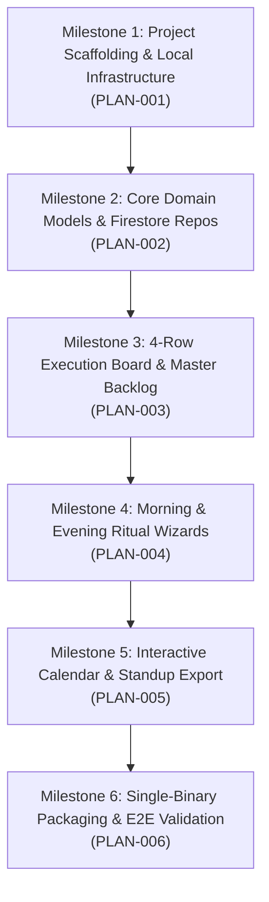

# DailyCheckIn - Milestone Roadmap

## Overview
This roadmap defines the vertical slices and milestone progression for building **DailyCheckIn**, following the 5-agent agile squad lifecycle (`@product-owner` $\rightarrow$ `@ui-designer` / `@devops-engineer` $\rightarrow$ `@developer` $\rightarrow$ `@tester`).

---

## 🗺️ Milestone Progression

---

## Milestone Breakdown

### 🏗️ Milestone 1: Project Scaffolding & Local Infrastructure (PLAN-001)
- **Focus:** Foundational backend (Go 1.23+ Echo), frontend (Vite + React 18 + TS + Tailwind CSS), and Docker-based Firebase emulator infrastructure.
- **Key Artifacts:**
  - `go.mod`, Echo server entrypoint (`cmd/server/main.go`), health check endpoint (`/api/health`).
  - `frontend/` package setup with Tailwind CSS tokens, Lucide icons, TanStack Query, and Vite proxy.
  - `docker-compose.yml` for Firestore (`:8080`), Auth (`:9099`), and Emulator UI (`:4000`).
  - GitHub Actions CI workflow skeleton.
- **Sign-Off:** `go test ./...` and `npm run build` pass; health check verifies backend connectivity.

---

### 📦 Milestone 2: Core Domain Models & Firestore Repositories (PLAN-002)
- **Focus:** Data persistence layer for the core entities defined in `SPECIFICATION.md`.
- **Entities & Collections:**
  - `DaySession` (`/users/{uid}/days/{date}`)
  - Master `Task` (`/users/{uid}/tasks/{taskId}`)
  - Day-Task Association `DayTask` (`/users/{uid}/days/{date}/day_tasks/{taskId}`)
- **Key Deliverables:**
  - Go domain structs, DTOs, Firestore repositories, and composite indexes (`firestore.indexes.json`).
  - Integration tests running against the local Firestore emulator.
- **Sign-Off:** 100% repository unit & emulator integration test pass rate.

---

### 📋 Milestone 3: 4-Row Execution Board & Global Backlog CRUD (PLAN-003)
- **Focus:** The primary daily execution interface with drag-and-drop mechanics.
- **Components & Features:**
  - 4 Execution Rows: **Yesterday** (read-only completed), **Today** (prioritized 1..N), **Blocked** (with blocker reason notes), and **Backlog** (persistent global pool).
  - Drag-and-drop reordering & row transitions (`@hello-pangea/dnd`).
  - Instant checkbox completion toggle with optimistic TanStack Query updates.
  - Quick task creation modal / inline inputs.
- **Sign-Off:** QA validation of drag-and-drop, state updates, and optimistic UI synchronization.

---

### 🌅 Milestone 4: Morning Check-In & End-of-Day Ritual Wizards (PLAN-004)
- **Focus:** The structured morning and evening ritual workflows.
- **Workflows:**
  - **Morning Check-In Wizard:**
    1. Review yesterday's accomplishments.
    2. Rollover incomplete tasks from previous active day into Today or Backlog.
    3. Pull and prioritize items from the Global Backlog.
    4. Commit and stamp `check_in_at`.
  - **End-of-Day Check-Out Wizard:**
    1. Review Today's completed tasks.
    2. Triage incomplete tasks (roll over vs. demote to Backlog).
    3. Daily reflections and notes.
    4. Commit and stamp `check_out_at`.
- **Sign-Off:** Automated Gherkin test suite validating session state transitions.

---

### 📅 Milestone 5: Interactive Calendar & Standup Markdown Export (PLAN-005)
- **Focus:** Temporal navigation, historical day reviews, and standup sharing.
- **Features:**
  - Month-view calendar in top-left with check-in status indicators (completed, incomplete, checked out).
  - Quick date navigation ("Jump to Today", historical read-only day inspection).
  - 1-Click Standup Markdown Generator (formatted for Slack / Teams / Email with Yesterday, Today, Blockers).
- **Sign-Off:** Browser E2E verification of date jumping and clipboard export copying.

---

### 🚀 Milestone 6: Single-Binary Packaging & E2E Validation (PLAN-006)
- **Focus:** Production packaging, multi-stage Docker build, and final QA verification.
- **Deliverables:**
  - Embedded React SPA bundle inside Go binary using `//go:embed`.
  - Production multi-stage `Dockerfile` and Google Cloud Run deployment configuration.
  - Full end-to-end regression test report archived in `test-reports/`.
- **Sign-Off:** Standalone single executable verified running without external dependencies.
